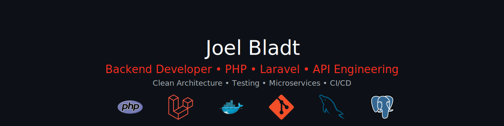

  

<!--HEADER-->
<h1 align="center">👋 Hi, ich bin Joel Bladt</h1>

  🇬🇧 <a href="README.md">English version</a>

  <strong>Backend Developer • API Engineering • PHP Enthusiast</strong> 
  Entwicklung zuverlässiger Backend-Systeme mit Fokus auf Clean Architecture, Testbarkeit und Developer Experience.

  

<!--ROLE BADGES-->

  

<!--TECH BADGES-->

  
  
  
  
  

---

## 🧭 Über mich

Ich bin ein Backend-orientierter Entwickler mit langjähriger Erfahrung in der **API-Entwicklung**,  
**serviceorientierten Architekturen** und **wartbaren PHP-Anwendungen**.

Aus einer IT-geprägten Familie kommend begann ich bereits mit 14 Jahren zu programmieren.  
Seitdem habe ich eine professionelle Laufbahn aufgebaut, die sich auf **Backend Engineering**,  
**sauberen Code** und **skalierbare Systeme** konzentriert.

Meine Stärken:

- Konzeption & Entwicklung **robuster REST APIs** und modularer Backendarchitekturen  
- Migration von Monolithen zu **serviceorientierten Strukturen**  
- Sicherstellung hoher Codequalität durch **PHPUnit, PHPStan, CI/CD**  
- Performanceanalyse, Debugging & Monitoring  
- Schreiben wartbarer, strukturierter und gut dokumentierter Backendlösungen  

---

## 🔧 Tech Stack

### **Programmiersprachen**

  
  
  
  

### **Backend-Frameworks**

  
  

### **Qualität & Architektur**

  
  
  
  
  
  
  
  

### **Datenbanken**

  
  
  
  

### **Tools & Umgebung**

  
  
  
  
  
  
  

---

## 🚀 Ausgewählte Projekte

### 🔹 Laravel API Boilerplate  
Eine strukturierte Grundlage zum Aufbau skalierbarer, gut organisierter REST APIs in Laravel.  
Beinhaltet Konventionen, Ordnerstrukturen, Guidelines und praktische Patterns.  
🔗 https://github.com/joelbladt/laravel-api-boilerplate

---

### 🔹 Go Guestbook  
Ein kleines Gästebuchprojekt in Go mit Routing, Server-Setup  
und einem minimalen Templating-Ansatz.  
🔗 https://github.com/joelbladt/go-guestbook

---

### 🔹 Daily Quote Crawler (bladt.de)  
Automatischer Crawler zum Abrufen und Aktualisieren eines täglichen Zitats.  
Beinhaltet leichtgewichtiges Parsing & automatisierte Deployments.  
🔗 https://bladt.de

---

## 📈 Woran ich aktuell arbeite

- Aktive Suche nach einer neuen Position im Backend Engineering  
- Vertiefung meiner technischen Grundlagen durch Lernen & Praxis  
- Auffrischung moderner PHP- und Laravel-Patterns  
- Vorbereitung auf Interviews und technische Assessments  

---

## 📨 Kontakt

- ✉️ **E-Mail:** joel@bladt.de  
- 💼 **LinkedIn:** https://www.linkedin.com/in/joelbladt  
- 🌐 **Webseite:** https://bladt.de  

---

  <i>„Make it work. Make it right. Make it fast.“</i>

